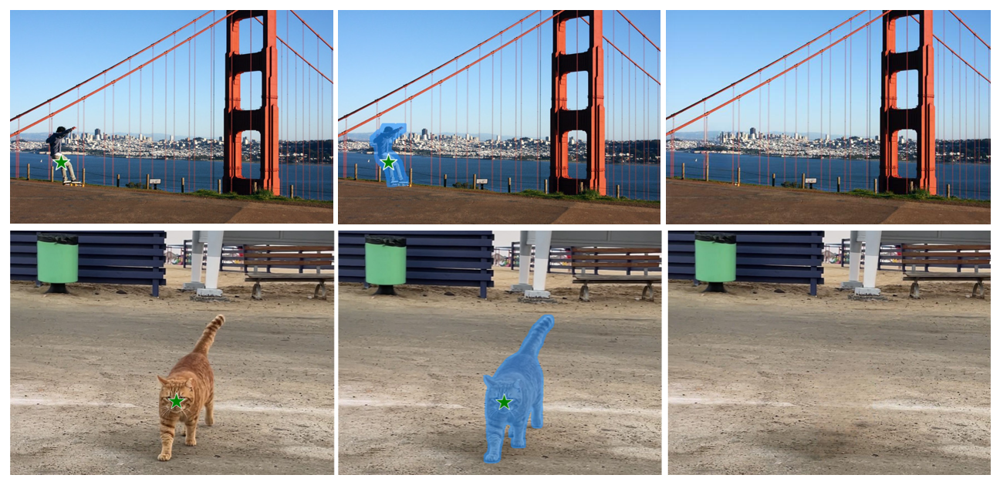

# Inpaint Anything Paddle

该项目是对  [Inpaint Anything](https://github.com/geekyutao/Inpaint-Anything) 官方项目的 paddle 实现， 采用分割大模型 Segment Anything（SAM）获得图像 mask，采用图像修复模型 LaMa 进行图像移除，并采用 stable_diffusion_inpaint 进行文本引导的图像编辑。用户可以通过图像中任意对象的点坐标，平滑地进行对象移除。此外，用户还可以通过文本提示，用任何内容填充对象，或任意替换对象的背景。同时，本人结合 PP-YOLOE 在COCO 数据集上的预训练模型，对图像级的 Remove Anything 进行扩展，实现了指定类别的视频目标移除（Remove Anything Video）。

该项目可以在 AI Studio V100 16G 环境下运行，项目的主要工作是对  LaMa 模型的推理部分及依赖库 kornia 部分函数进行复现， 并通过调用 PaddleSeg 的 Segment Anything（SAM）模型 和 PaddleNLP 的 Stable Diffusion Inpaint模型， 完成 Inpaint Anything 相应功能的实现。对于视频目标移除部分，该项目首先采用PP-YOLOE 检测视频中的所有目标，之后，将每帧图像中用户需要移除对象的边界框依次送入到 SAM 模型中，获得每个移除对象的 mask，并将所有对象mask汇总为最终 mask，送入到 LaMa 模型中，进行对象移除。


### 环境配置

```bash
# 安装 paddleseg,以便调用其中的SAM模型
pip install --user paddleseg==2.8.0
# 安装 LaMA 相关依赖库
pip install --user omegaconf
# 安装SAM模型的依赖包
pip install --user ftfy regex
# 安装 pddiffuser，以便调用其中的paddlenlp 模型
pip install --user --upgrade ppdiffusers
```
非 AI Studio 用户如果想要在本地体验，还需要安装 paddle
```bash
python -m pip install paddlepaddle-gpu==2.4.2.post112 -f https://www.paddlepaddle.org.cn/whl/linux/mkl/avx/stable.html
```


## <span id="remove-anything">📌 Remove Anything</span>
```
cd work
python remove_anything.py \
    --input_img  /home/aistudio/work/example/remove-anything/cat.jpg \
    --point_coords 600 1100 \
    --point_labels 1 \
    --dilate_kernel_size 15 \
    --output_dir /home/aistudio/work/results \
    --sam_model_type "vit_l" \
    --lama_config  /home/aistudio/work/lamn/big_lanm/config.yaml \
    --lama_ckpt /home/aistudio/data/data211468/paddle_gen.pdparams \
    --predict_config /home/aistudio/work/lamn/config/default.yml
```

### Demo


## <span id="remove-anything-video">📌 Remove Angthing Video</span>
```
cd work
python remove_anything_video.py \
    --input_video /home/aistudio/work/example/remove-anything-video/car.mp4 \
    --remove_type "car"\
    --dilate_kernel_size 15 \
    --output_dir /home/aistudio/work/results \
    --sam_model_type "vit_l" \
    --lama_config  /home/aistudio/work/lamn/big_lanm/config.yaml \
    --lama_ckpt /home/aistudio/data/data211468/paddle_gen.pdparams \
    --predict_config /home/aistudio/work/lamn/config/default.yml
```
### Demo


## <span id="Fill Anything">📌 Fill Anything</span>
```
cd work
python fill_anything.py \
    --input_img /home/aistudio/work/example/fill-anything/sample5.png\
    --point_coords 627 845\
    --point_labels 1 \
    --text_prompt "a Picasso painting on the wall" \
    --dilate_kernel_size 50 \
    --output_dir /home/aistudio/work/results \
    --sam_model_type "vit_l" 
```
### Demo


## <span id="Replace Anything">📌 Replace Anything</span>
```
cd work
python replace_anything.py \
    --input_img /home/aistudio/work/example/replace-anything/dog.png \
    --point_coords 750 500 \
    --point_labels 1 \
    --text_prompt "sit on the swing" \
    --output_dir  /home/aistudio/work/results \
    --sam_model_type "vit_l" \
```
### Demo


## Acknowledgments
- [Segment Anything](https://github.com/facebookresearch/segment-anything)
- [LaMa](https://github.com/advimman/lama)
- [Stable Diffusion](https://github.com/CompVis/stable-diffusion)


## 参考项目：

【1】 [Inpaint Anything: Segment Anything Meets Image Inpainting](https://github.com/geekyutao/Inpaint-Anything)\
【2】 [Segment Anything with PaddleSeg](https://github.com/PaddlePaddle/PaddleSeg/tree/release/2.8/contrib/SegmentAnything)\
【3】 [PPDiffusers: Diffusers toolbox implemented based on PaddlePaddle](https://github.com/PaddlePaddle/PaddleNLP/tree/develop/ppdiffusers)\
【4】[Omnimatte in PyTorch](https://github.com/erikalu/omnimatte)